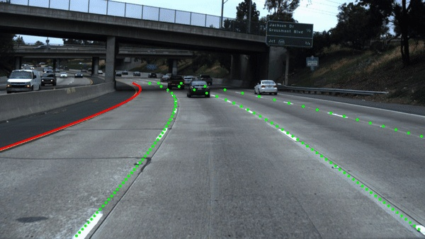

# awesome-lane-detection
Lane Detection

[Paper](#Paper)

- [2023](#2023)
- [2022](#2022)
- [2021](#2021)
- [2020](#2020)
- [2019](#2019)
- [2018](#2018)
- [2017](#2017)

[Code](#Code)

[Blog/Tutorial](#Blog/Tutorial)

[Datasets](#Datasets)

# Paper

## 2023

[Decoupling the Curve Modeling and Pavement Regression for Lane Detection](https://arxiv.org/abs/2309.10533)

[Recursive Video Lane Detection](https://arxiv.org/abs/2308.11106)  [github](https://github.com/dongkwonjin/RVLD)  ICCV 2023

[LATR: 3D Lane Detection from Monocular Images with Transformer](https://arxiv.org/abs/2308.04583)  [github](https://github.com/JMoonr/LATR)  ICCV 2023

[GroupLane: End-to-End 3D Lane Detection with Channel-wise Grouping](https://arxiv.org/abs/2307.09472)

[An Efficient Transformer for Simultaneous Learning of BEV and Lane Representations in 3D Lane Detection](https://arxiv.org/abs/2306.04927)

[BEV-LaneDet: a Simple and Effective 3D Lane Detection Baseline](https://arxiv.org/abs/2210.06006)  [github](https://github.com/gigo-team/bev_lane_det)  CVPR 2023

[Anchor3DLane: Learning to Regress 3D Anchors for Monocular 3D Lane Detection](https://arxiv.org/abs/2301.02371)  [github](https://github.com/tusen-ai/Anchor3DLane)  CVPR 2023

[End to End Lane detection with One-to-Several Transformer](https://arxiv.org/abs/2305.00675)  [github](https://github.com/zkyseu/O2SFormer)

## 2022

[Repainting and Imitating Learning for Lane Detection](https://arxiv.org/abs/2210.05097)

[WS-3D-Lane: Weakly Supervised 3D Lane Detection With 2D Lane Labels](https://arxiv.org/abs/2209.11523)

[CurveFormer: 3D Lane Detection by Curve Propagation with Curve Queries and Attention](https://arxiv.org/abs/2209.07989)

[PriorLane: A Prior Knowledge Enhanced Lane Detection Approach Based on Transformer]( https://arxiv.org/abs/2209.06994 )  [github](https://github.com/vincentqqb/PriorLane)

[M^2-3DLaneNet: Multi-Modal 3D Lane Detection](https://arxiv.org/abs/2209.05996)

[RCLane: Relay Chain Prediction for Lane Detection](https://arxiv.org/abs/2207.09399)  ECCV 2022

[PersFormer: 3D Lane Detection via Perspective Transformer and the OpenLane Benchmark](https://arxiv.org/abs/2203.11089)  [github](https://github.com/OpenPerceptionX/PersFormer_3DLane)  [OpenLane Dataset](https://github.com/OpenPerceptionX/OpenLane)  ECCV 2022 Oral

[Reconstruct from Top View: A 3D Lane Detection Approach based on Geometry Structure Prior](https://arxiv.org/abs/2206.10098)

[Multi-level Domain Adaptation for Lane Detection](https://arxiv.org/abs/2206.10692)

[Ultra Fast Deep Lane Detection with Hybrid Anchor Driven Ordinal Classification](https://arxiv.org/abs/2206.07389)  [github](https://github.com/cfzd/Ultra-Fast-Lane-Detection-v2)  TPAMI 2022

[ONCE-3DLanes: Building Monocular 3D Lane Detection](https://arxiv.org/abs/2205.00301)  [Homepage](https://once-3dlanes.github.io/)  [github](https://github.com/once-3dlanes/once_3dlanes_benchmark)  [Dataset](https://once-3dlanes.github.io/3dlanes/)  CVPR 2022

[A Keypoint-based Global Association Network for Lane Detection](https://arxiv.org/abs/2204.07335)  [github](https://github.com/Wolfwjs/GANet)  CVPR 2022

[Eigenlanes: Data-Driven Lane Descriptors for Structurally Diverse Lanes](https://arxiv.org/abs/2203.15302)  [github](https://github.com/dongkwonjin/Eigenlanes)   [SDLane  Dataset](https://www.42dot.ai/akit/dataset/)  CVPR 2022

[Towards Driving-Oriented Metric for Lane Detection Models](https://arxiv.org/abs/2203.16851)  [Comma2k19 LD Dataset](https://www.kaggle.com/datasets/tkm2261/comma2k19-ld)  CVPR 2022

[CLRNet: Cross Layer Refinement Network for Lane Detection](https://arxiv.org/abs/2203.10350)  CVPR 2022

[Rethinking Efficient Lane Detection via Curve Modeling](https://arxiv.org/abs/2203.02431)  [github](https://github.com/voldemortX/pytorch-auto-drive)  CVPR 2022

[Lane detection with Position Embedding](https://arxiv.org/abs/2203.12301)

[AtrousFormer：Lane Detection with Versatile AtrousFormer and Local Semantic Guidance](https://arxiv.org/abs/2203.04067)

[Laneformer: Object-Aware Row-Column Transformers for Lane Detection](https://www.aaai.org/AAAI22Papers/AAAI-6756.HanJ.pdf)  AAAI 2022

[RONELDv2: A faster, improved lane tracking method](https://arxiv.org/abs/2202.13137)

## 2021

[SwiftLane: Towards Fast and Efficient Lane Detection](https://arxiv.org/abs/2110.11779)  ICMLA 2021

[A Hybrid Spatial-temporal Sequence-to-one Neural Network Model for Lane Detection](https://arxiv.org/abs/2110.04079)

[YOLOP: You Only Look Once for Panoptic Driving Perception](https://arxiv.org/abs/2108.11250)  [github](https://github.com/hustvl/YOLOP)

[VIL-100: A New Dataset and A Baseline Model for Video Instance Lane Detection](https://arxiv.org/abs/2108.08482)  [github](https://github.com/yujun0-0/MMA-Net)  [dataset](https://github.com/yujun0-0/MMA-Net)  ICCV 2021

[ContinuityLearner: Geometric Continuity Feature Learning for Lane Segmentation](https://arxiv.org/abs/2108.03507)

[On Robustness of Lane Detection Models to Physical-World Adversarial Attacks in Autonomous Driving](https://arxiv.org/abs/2107.02488)

[Structure Guided Lane Detection](https://arxiv.org/abs/2105.05403)  IJCAI 2021

[CondLaneNet: a Top-to-down Lane Detection Framework Based on Conditional Convolution](https://arxiv.org/abs/2105.05003)

[Keep your Eyes on the Lane: Real-time Attention-guided Lane Detection](https://arxiv.org/abs/2010.12035)  [github](https://github.com/lucastabelini/LaneATT)  CVPR 2021

[YOLinO: Generic Single Shot Polyline Detection in Real Time](https://arxiv.org/abs/2103.14420)

[LaneAF: Robust Multi-Lane Detection with Affinity Fields](https://arxiv.org/abs/2103.12040)  [github](https://github.com/sel118/LaneAF)

[Robust Lane Detection via Expanded Self Attention](https://arxiv.org/abs/2102.07037)

[End-to-End Deep Learning of Lane Detection and Path Prediction for Real-Time Autonomous Driving](https://arxiv.org/abs/2102.04738)

## 2020

[End-to-end Lane Shape Prediction with Transformers](https://arxiv.org/abs/2011.04233)  [github](https://github.com/liuruijin17/LSTR)  WACV 2021

[3D-LaneNet+: Anchor Free Lane Detection using a Semi-Local Representation](https://arxiv.org/abs/2011.01535)

[Keep your Eyes on the Lane: Attention-guided Lane Detection](https://arxiv.org/abs/2010.12035)  [github](https://github.com/lucastabelini/LaneATT)

[RONELD: Robust Neural Network Output Enhancement for Active Lane Detection](https://arxiv.org/abs/2010.09548)  [github](https://github.com/czming/RONELD-Lane-Detection)  ICPR 2020

[RESA: Recurrent Feature-Shift Aggregator for Lane Detection](https://arxiv.org/abs/2008.13719)   [github](https://github.com/ZJULearning/resa)  AAAI 2021

[CurveLane-NAS: Unifying Lane-Sensitive Architecture Search and Adaptive Point Blending](https://arxiv.org/abs/2007.12147)  ECCV 2020  [Datasets](https://github.com/xbjxh/curvelanes)

[Towards Lightweight Lane Detection by Optimizing Spatial Embedding](https://arxiv.org/abs/2008.08311)  ECCV 2020 Workshop 

[Structure-Aware Network for Lane Marker Extraction with Dynamic Vision Sensor](https://arxiv.org/abs/2008.06204)

[Lane Detection Model Based on Spatio-Temporal Network with Double ConvGRUs](https://arxiv.org/abs/2008.03922)

[Heatmap-based Vanishing Point boosts Lane Detection](https://arxiv.org/abs/2007.15602)

[Synthetic-to-Real Domain Adaptation for Lane Detection](https://arxiv.org/abs/2007.04023)

[E2E-LMD: End-to-End Lane Marker Detection via Row-wise Classification](https://arxiv.org/abs/2005.08630)

[SUPER: A Novel Lane Detection System](https://arxiv.org/abs/2005.07277)

[Ultra Fast Structure-aware Deep Lane Detection](https://arxiv.org/abs/2004.11757)  [github](https://github.com/cfzd/Ultra-Fast-Lane-Detection)  ECCV 2020

[PolyLaneNet: Lane Estimation via Deep Polynomial Regression](https://github.com/lucastabelini/PolyLaneNet)  [github](https://github.com/lucastabelini/PolyLaneNet)

[Inter-Region Affinity Distillation for Road Marking Segmentation](https://arxiv.org/abs/2004.05304)  [github](https://github.com/cardwing/Codes-for-IntRA-KD)  CVPR 2020

[Gen-LaneNet: A Generalized and Scalable Approach for 3D Lane Detection](https://arxiv.org/abs/2003.10656)  [github](https://github.com/yuliangguo/Pytorch_Generalized_3D_Lane_Detection) [Datasets](https://github.com/yuliangguo/3D_Lane_Synthetic_Dataset)  ECCV 2020

[Detecting Lane and Road Markings at A Distance with Perspective Transformer Layers](https://arxiv.org/abs/2003.08550)

[Semi-Local 3D Lane Detection and Uncertainty Estimation](https://arxiv.org/abs/2003.05257)

[FusionLane: Multi-Sensor Fusion for Lane Marking Semantic Segmentation Using Deep Neural Networks](https://arxiv.org/abs/2003.04404) [github](https://github.com/rolandying/FusionLane)

[PINet：Key Points Estimation and Point Instance Segmentation Approach for Lane Detection](https://arxiv.org/abs/2002.06604)  [github](https://github.com/koyeongmin/PINet)

[Better-CycleGAN + ERFNet: Lane Detection in Low-light Conditions Using an Efficient Data Enhancement : Light Conditions Style Transfer](https://arxiv.org/abs/2002.01177)  submitted to IV 2020 

[Multi-lane Detection Using Instance Segmentation and Attentive Voting](https://arxiv.org/abs/2001.00236)   ICCAS 2019 

## 2019

[Dynamic Approach for Lane Detection using Google Street View and CNN](<https://arxiv.org/abs/1909.00798>)  IEEE TENCON 2019

[Learning Lightweight Lane Detection CNNs by Self Attention Distillation](https://arxiv.org/abs/1908.00821)  [github](https://github.com/cardwing/Codes-for-Lane-Detection)  ICCV 2019

[Multi-Class Lane Semantic Segmentation using Efficient Convolutional Networks](https://arxiv.org/abs/1907.09438)  MMSP 2019

[Lane Detection and Classification using Cascaded CNNs](https://arxiv.org/abs/1907.01294)  Eurocast 2019

[Driver Behavior Analysis Using Lane Departure Detection Under Challenging Conditions](https://arxiv.org/abs/1906.00093)

[FastDraw: Addressing the Long Tail of Lane Detection by Adapting a Sequential Prediction Network](https://arxiv.org/abs/1905.04354)  CVPR 2019

[Agnostic Lane Detection](https://arxiv.org/abs/1905.03704)  [github](https://github.com/cardwing/Codes-for-Lane-Detection)

[Deep Multi-Sensor Lane Detection](https://arxiv.org/abs/1905.01555) IROS2018

[Enhanced free space detection in multiple lanes based on single CNN with scene identification](https://arxiv.org/abs/1905.00941) IV2019 [github](https://github.com/fabvio/ld-lsi/)

[Robust Lane Detection from Continuous Driving Scenes Using Deep Neural Networks](https://arxiv.org/abs/1903.02193)

[End-to-end Lane Detection through Differentiable Least-Squares Fitting](https://arxiv.org/abs/1902.00293)  [github](https://github.com/wvangansbeke/LaneDetection_End2End)

## 2018

[End to End Video Segmentation for Driving : Lane Detection For Autonomous Car](https://arxiv.org/abs/1812.05914)

[3D-LaneNet: end-to-end 3D multiple lane detection](https://arxiv.org/abs/1811.10203)  ICCV 2019

[Efficient Road Lane Marking Detection with Deep Learning](https://arxiv.org/abs/1809.03994) DSP 2018

[Multiple Lane Detection Algorithm Based on Optimised Dense Disparity Map Estimation](https://arxiv.org/abs/1808.09128) IST 2018

 [LineNet: a Zoomable CNN for Crowdsourced High Definition Maps Modeling in Urban Environments](https://arxiv.org/abs/1807.05696)

 [Real-time stereo vision-based lane detection system](https://arxiv.org/abs/1807.02752) 

 [LaneNet: Real-Time Lane Detection Networks for Autonomous Driving](https://arxiv.org/abs/1807.01726)

 [EL-GAN: Embedding Loss Driven Generative Adversarial Networks for Lane Detection](https://arxiv.org/abs/1806.05525)

 [Real-time Lane Marker Detection Using Template Matching with RGB-D Camera](https://arxiv.org/abs/1806.01621)

 [Towards End-to-End Lane Detection: an Instance Segmentation Approach](https://arxiv.org/abs/1802.05591)    [论文解读](https://mp.weixin.qq.com/s/sGbSiCHpKjqKe9FP1ykjGw)  [github](https://github.com/MaybeShewill-CV/lanenet-lane-detection)

 [Lane Detection and Classification for Forward Collision Warning System Based on Stereo Vision](https://ieeexplore.ieee.org/document/8353455/)

 [Advances in Vision-Based Lane Detection: Algorithms, Integration, Assessment, and Perspectives on ACP-Based Parallel Vision](https://ieeexplore.ieee.org/document/8332138/)

[(SCNN)Spatial As Deep: Spatial CNN for Traffic Scene Understanding](https://arxiv.org/abs/1712.06080)   AAAI 2018   [CSDN Translator](https://blog.csdn.net/u011974639/article/details/79580798?from=timeline#10006-weixin-1-52626-6b3bffd01fdde4900130bc5a2751b6d1)

 [Lane Detection Based on Inverse Perspective Transformation and Kalman Filter](http://itiis.org/digital-library/manuscript/file/1921/TIIS+Vol+12,+No+2-6.pdf)

# 2017

[A review of recent advances in lane detection and departure warning system](https://www.sciencedirect.com/science/article/pii/S0031320317303266)

[Deep Learning Lane Marker Segmentation From Automatically Generated Labels](https://ieeexplore.ieee.org/document/7989163/) [Youtube](https://www.youtube.com/watch?v=AH01wpqqaeA)

[VPGNet: Vanishing Point Guided Network for Lane and Road Marking Detection and Recognition](http://openaccess.thecvf.com/content_iccv_2017/html/Lee_VPGNet_Vanishing_Point_ICCV_2017_paper.html) ICCV 2017 [github](https://github.com/SeokjuLee/VPGNet)

# Code

https://github.com/voldemortX/pytorch-auto-drive

[Lane Detection（Paper with Code）](https://paperswithcode.com/task/lane-detection)

<https://github.com/cardwing/Codes-for-Lane-Detection>

<https://github.com/karstenBehrendt/unsupervised_llamas>

https://github.com/wvangansbeke/LaneDetection_End2End

<https://github.com/georgesung/advanced_lane_detection>

<https://github.com/MaybeShewill-CV/lanenet-lane-detection>

<https://github.com/XingangPan/SCNN>

<https://github.com/davidawad/Lane-Detection>

<https://github.com/yang1688899/CarND-Advanced-Lane-Lines>

<https://github.com/SeokjuLee/VPGNet>

<https://github.com/mvirgo/MLND-Capstone>：Lane Detection with Deep Learning

<https://github.com/galenballew/SDC-Lane-and-Vehicle-Detection-Tracking>

<https://github.com/shawshany/Advance_LaneFinding>

# Blog/Tutorial

[Lane Detection with Deep Learning (Part 1)](https://towardsdatascience.com/lane-detection-with-deep-learning-part-1-9e096f3320b7)

[Simple Lane Detection with OpenCV](https://medium.com/@mrhwick/simple-lane-detection-with-opencv-bfeb6ae54ec0)

[Finding Lane Lines — Simple Pipeline For Lane Detection](https://towardsdatascience.com/finding-lane-lines-simple-pipeline-for-lane-detection-d02b62e7572b)

[Building a lane detection system using Python 3 and OpenCV](https://medium.com/@galen.ballew/opencv-lanedetection-419361364fc0)

[Tutorial: Build a lane detector](https://towardsdatascience.com/tutorial-build-a-lane-detector-679fd8953132)

[Online course: Algorithms for Automated Driving](https://thomasfermi.github.io/Algorithms-for-Automated-Driving/Introduction/intro.html)

# Datasets

- [TuSimple](https://github.com/TuSimple/tusimple-benchmark)
- [CULane](https://xingangpan.github.io/projects/CULane.html)
- [BDD100K](http://bdd-data.berkeley.edu/)
- [Caltech](http://www.mohamedaly.info/datasets/caltech-lanes)
- [VPGNet](https://github.com/SeokjuLee/VPGNet#vpgnet-dataset)
- [3D Lane Synthetic Dataset](https://github.com/yuliangguo/3D_Lane_Synthetic_Dataset) 
- [DIML](https://diml.yonsei.ac.kr/dataset/)
- [Jiqing Expressway](https://github.com/vonsj0210/Multi-Lane-Detection-Dataset-with-Ground-Truth)
- [A Dataset for Lane Instance Segmentation in Urban Environments](https://arxiv.org/abs/1807.01347)
- [LLAMAS：The Lane Marker Dataset](https://unsupervised-llamas.com/llamas/)
- [DET](https://spritea.github.io/DET/)
- [CurveLanes](https://github.com/xbjxh/curvelanes)
- [VIL-100](https://github.com/yujun0-0/MMA-Net)  ICCV 2021
- [Comma2k19 LD](https://www.kaggle.com/datasets/tkm2261/comma2k19-ld)  CVPR 2022
- [OpenLane: 3D lane datasets](https://github.com/OpenPerceptionX/OpenLane)  ECCV 2022 Oral
- [SDLane  Dataset](https://www.42dot.ai/akit/dataset/)  CVPR 2022
- [ONCE-3DLanes](https://once-3dlanes.github.io/3dlanes/)  CVPR 2022
- [OpenLane-V](https://github.com/dongkwonjin/RVLD)

# Contact & Feedback

If you have any suggestions about papers, feel free to mail me :)

- [blog](http://www.cverblog.cn/)
- [pull](https://github.com/amusi/awesome-lane-detection/pulls)